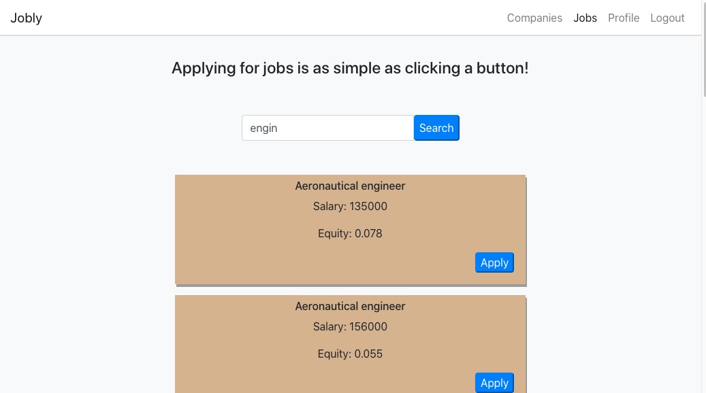

# [React Jobly](http://react-jobly.surge.sh/jobs)

### A frontend application built with React for a previously-built [mock-job searching API](https://github.com/langevinj/jobly) buit with Node, Express and PostgreSQL.  

This application acts as the frontend for my Jobly API, a user logs into their account, or signups for an account to gain access to numerous functions. A user can search for companies or jobs by typing into the live-updating search bars, or can scroll through listings, which paginate pages for ease of use. A user may apply or unapply for jobs as they see fit, and these applications persist when logging in or out. A user may also edit parts of their own information from their Profile page.

#### Try it out with my mock database here [React-Jobly](http://react-jobly.surge.sh/jobs).

#### Technologies Used:
* React 
* JavaScript 
* HTML
* CSS
* Bootstrap
* JSX 
* Jest
* lodash (debounce)

